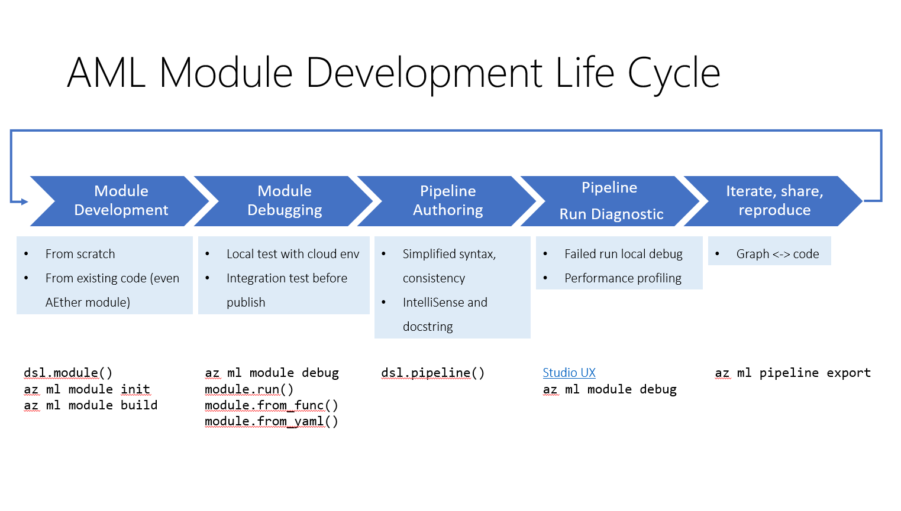

# Module development overview

In this article you will learn how to develop an Azure Machine Learning module.

## Overview of pipeline and module

A pipeline is a description of a machine learning (ML) workflow, including all of the tasks(modules) of the workflow and how they work together. 

A module is an implementation of a pipeline task. A module represents a step in the workflow. Each module takes one or more inputs and may produce one or more outputs. A module consists of an interface (inputs/outputs), the implementation (source code, command-line arguments and environment) and metadata (name, description).

A few terminology you will see: 

|Terminology|Description|
| -----------| ----------- |
|YAML spec| Module specification in YAML format. It describes all information (interface, implementation, metadata) needed to reproduce a module. YAML spec is needed when register the module to an AML workspace. See example [here](https://github.com/Azure/DesignerPrivatePreviewFeatures/blob/master/azureml-modules/docs/module-spec-definition.md).|
|dsl module|A module wrapped by dsl decorator. By using dsl decorator, it's easier to interact with the module. And some module development feature is build on top dsl module. See example [here](). |
|dsl pipeline|A pipeline wrapped by dsl decorator. By using dsl pipeline, it's easier to interact with the pipeline. We recommend to use dsl pipeline to define your pipeline. See example [here](). |

## Module/Pipeline development lifecycle
Module and pipeline development is an iterative process. It includes build module, test module, build pipeline, test pipeline and share/reuse. We have provide several CLI commands and SDK functions to boost the efficiency in the development lifecycle.

### Module development

#### Feature overview

|CLI Command|Purpose|
| -----------| ----------- |
|az ml module init| Initialize a template dsl module project. The template contains following useful files in module development process.   - module_name.py: module source code template   - module_name.spec.yaml: module spec in yaml format. Needed to register the module.   - module_name_test.ipynb: template test notebook for the module   - module_name_test.py: unit test template for the module  |
|az ml module build|Automatically build yaml spec from source code that wrapped as dsl module. With this command, customer don't need to edit the yaml spec manually. |

#### Video

[video-how-to-build-new-module]()

#### Sample Notebook

[sample-notebook]()

### Module debug

#### Feature overview
|CLI Command|Purpose|
| -----------| ----------- |
|az ml module debug|Debug a module by running it in local container, in which customer can use local debug tools, for example VSCode debugger. Use it in following scenario:    - A module failed in remote run. This command will pull down the image from cloud to debug locally.     - Test a module with cloud environment before submit to remote run. This command can run a not registered module in local container.|

|SDK function|Purpose|
| -----------| ----------- |
|module.from_func|Load module from a python function. Then you can run the module in local to test.|
|module.from_yaml|Load module from yaml spec. Then you can run the module in local to test. |
|module.run|Run module in your local Python environment or local docker container.|

#### Video

[video-how-to-debug-module]()

#### Sample notebook

[sample-notebook]()

### Build pipeline

#### Feature overview

Module SDK provide dsl pipeline wrapper to make it easier to build and interact with pipeline. 

#### Video 

[video-how-to-build-pipeline-with-module]()

#### Sample notebooks

[build-pipeline-basic](https://github.com/Azure/DesignerPrivatePreviewFeatures/blob/sdkpreview/azureml-modules/samples/get-started.ipynb)

[create-pipeline-with-subpipeline](https://github.com/Azure/DesignerPrivatePreviewFeatures/blob/sdkpreview/azureml-modules/samples/create-pipeline-with-subpipeline.ipynb)

[showcasing-dataset-and-pipeline-parameter](https://github.com/Azure/DesignerPrivatePreviewFeatures/blob/sdkpreview/azureml-modules/samples/showcasing-dataset-and-pipelineparameter.ipynb)

[setup-versioned-pipeline-endpoints](https://github.com/Azure/DesignerPrivatePreviewFeatures/blob/sdkpreview/azureml-modules/samples/setup-versioned-pipeline-endpoints.ipynb)

### Debug pipeline
#### Feature overview
|SDK function|Purpose|
| -----------| ----------- |
|pipeline.run|It's a light-weight orchestrator in local. In particularly it does following things under the hook:   -  Download remote dataset to local   - Pickup nodes which dependencies are ready, e.g. firstly with nodes that has no dependency node    - Send the picked nodes in a thread pool (size depends on number of processors on machine by default, user can specify this by max_workers parameter)    - Execute each node using module.run, which will be executing in separate container/process    - When node complete, will pickup next ready nodes in downstream to execute, until all nodes in the pipeline complete
|

#### Video
[video-how-to-debug-pipeline]()

#### Sample notebook

[sample-notebook]()

### Share and resue

#### Feature overview
|CLI command|Purpose|
| -----------| ----------- |
|az ml module register|Register a module to an AML workspace. After registration, the module will be shared to all users that have access to the workspace. An it can be consumed both from [AML Designer UI](https://ml.azure.com/) and SDK.|
|az ml pipeline export|Export a pipeline graph to code. See sample [here](). |

#### Video
[video-how-share-reuse-module]()
